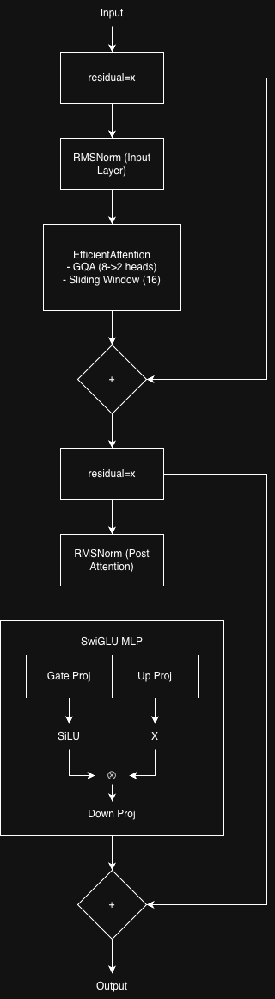
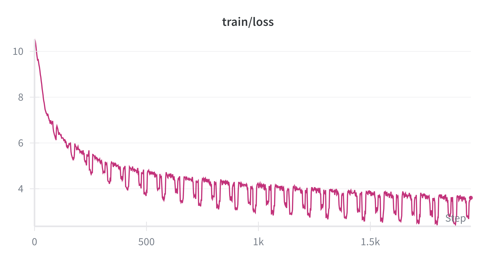
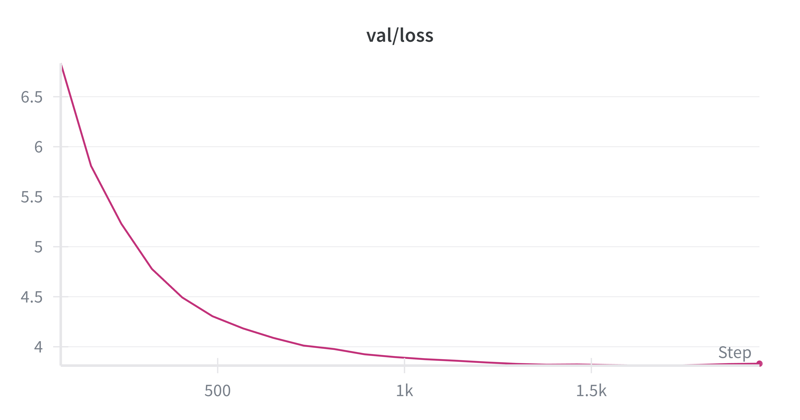

# HeliumLM: A Tiny, Powerful Language Model


HeliumLM is a 13.44M parameter Small Language Model (SLM) designed from the ground up for extreme efficiency. With a peak memory footprint under 600 MB, it demonstrates that powerful, generative AI can run effectively on resource-constrained devices without sacrificing core capabilities.

This project documents the entire journey of creating a language model, from architectural design and data curation to training dynamics and fine-tuning, serving as a practical guide for building custom SLMs.

## 🚀 Key Features

HeliumLM's efficiency is not an accident; it's the result of a series of deliberate architectural choices and a quality-focused data strategy.

### Architecture Overview

The core of HeliumLM is a stack of 8 decoder-only transformer blocks. Each block is meticulously designed for efficiency, combining modern techniques to minimize computation and memory usage while maximizing performance.



### Architectural Innovations

The key components that make this architecture so efficient are detailed below, with visual explanations for some of the core concepts.


1.  **Grouped-Query Attention (GQA)**: Reduces the size of the KV cache by 75% by allowing multiple query heads to share key/value pairs, drastically cutting memory usage during inference.
2.  **Sliding Window Attention (SWA)**: Keeps attention computation linear (*O(N)*), enabling the model to handle long sequences without the quadratic complexity of standard attention.
3.  **Rotary Positional Embeddings (RoPE)**: Provides a flexible understanding of relative word positions, allowing the model to generalize to sequences longer than it was trained on.
4.  **SwiGLU Activation**: Uses a gated activation function in the feed-forward network to improve learning capacity and expressiveness per parameter.
5.  **Weight Tying**: Halves the parameters in the embedding/output layers by sharing the same weight matrix, saving over 8M parameters.

### Data Strategy: The Three-Phase Curriculum

HeliumLM was trained using a structured, three-phase curriculum designed to build knowledge systematically.

1.  **Phase 1: Foundational Knowledge (Pre-training)**: The model learned language structure and world knowledge from a high-quality, synthetically generated "textbook" dataset.
2.  **Phase 2: Learning to Converse (Instruction Tuning)**: The model was taught the user-assistant chat format using a curated subset of the Dolly-15k and Alpaca datasets.
3.  **Phase 3: Corrective Tutoring (Knowledge Injection)**: Specific factual errors observed during testing were corrected by oversampling a small, targeted dataset of facts.

## 📊 Performance

### Efficiency Benchmarks

HeliumLM was benchmarked against TinyBERT (a 14.38M parameter distilled encoder) on a CPU to measure real-world efficiency.

| Metric         | HeliumLM (Ours)        | TinyBERT (Baseline)      | Difference          |
| :------------- | :--------------------- | :----------------------- | :------------------ |
| **Architecture**   | Decoder (Generative)   | Encoder (Discriminative) | N/A                 |
| **Parameters**     | **13.44 M**            | 14.38 M                  | **-6.5% (Smaller)** |
| **Peak RAM**       | **598 MB**             | 651 MB                   | **-8.1% (Leaner)**  |
| **Throughput**     | 152 tok/sec            | 171 tok/sec              | -11.1% (Slower)     |

HeliumLM is **8.1% more memory-efficient** while being a **fully generative model**, a capability its encoder-only counterpart lacks entirely.

### Training Performance

The pre-training phase shows a stable convergence, with the validation loss plateauing as the model begins to overfit, highlighting the importance of early stopping.

| Training Loss Curve | Validation Loss Curve |
| :---: | :---: |
|  |  |

## 🛠️ How to Use

Follow these steps to replicate the training and fine-tuning process.

### 1. Prerequisites

*   Python 3.11+
*   `uv` (or `pip`) for package installation
*   For GPU training: An NVIDIA GPU with CUDA support or a Mac with Apple Silicon (MPS).

### 2. Installation

Clone the repository and install the required packages:

```bash
git clone https://github.com/your-username/HeliumLM.git
cd HeliumLM
uv pip install -r requirements.txt
```

### 3. Tokenizer Training

Before training the model, you need to train a tokenizer on your corpus.

```bash
python src/data/tokenizer.py
```

This will create a `tiny_slm_tokenizer.json` file in the `data/tokenizer/` directory.

### 4. Pre-training the Model

This is the first phase of training, where the model learns from the textbook data.

**To run locally (CPU/MPS):**

```bash
python train.py
```

**To run on a cloud GPU (recommended):**

This project is configured to use [Modal](https://modal.com/) for fast, on-demand GPU training.

```bash
# First-time setup
pip install modal
modal setup

# Run training on a T4 GPU
modal run modal_train.py --action train
```

### 5. Fine-tuning the Model

This second phase teaches the model to follow instructions and chat.

```bash
python finetune.py
```

This script will load the pre-trained model checkpoint and fine-tune it on the chat dataset.

## 📂 Project Structure

```
.
├── config/
│   └── config.json         # Model and training hyperparameters
├── data/
│   ├── raw/                # Raw datasets (e.g., hybrid_textbook_data.jsonl)
│   └── tokenizer/          # Trained tokenizer file
├── diagrams/               # Diagrams and plots for documentation
├── src/
│   ├── data/
│   │   ├── dataset.py      # PyTorch Dataset classes for loading data
│   │   └── tokenizer.py    # Script for training the tokenizer
│   └── model/
│       └── slm.py          # The core HeliumLM model architecture
├── train.py                # Main script for pre-training
├── finetune.py             # Script for instruction fine-tuning
├── modal_train.py          # Script for cloud-based GPU training with Modal
└── requirements.txt        # Python dependencies
```

## 📜 License

This project is licensed under the Apache-2.0 License. See the `LICENSE` file for details.